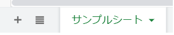
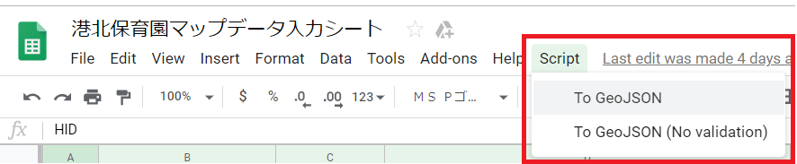

# data-processing-tools

GeoJSON形式のファイルを生成するツール

１、Googleスプレッドシートから直接GeoJSONファイルを生成する場合<br>
２、csv/shp形式のファイルからGeoJSONファイルを生成する場合　　※最終更新は2018年

<br>

## Googleスプレッドシートから直接GeoJSONファイルを生成する場合

Googleスプレッドシート上のメニューコマンド（Google Apps Script）  

<br>

### 使い方

1. Webブラウザで対象のGoogleスプレッドシートを開く。

2. GeoJSONファイルを生成したいシートを選択(アクティブに)する。

    

3. メニューバーの「Script」を選択し、サブメニューから「To GeoJSON」をクリックする。

   ※スプレッドシートを開いてから「Script」が表示されるまで数秒遅れる場合があります。<br>
   ※自身のGoogleアカウントで初めて実行する場合は承認の画面が表示されます。（後述）<br>
   
   サブメニューで実行できるコマンドには以下の2種類あります。

    - <b>To GeoJSON</b>  -> 座標列(X, Y)のデータのチェックあり（小数点以下5桁の数値かどうか）
    - <b>To GeoJSON (No Validation)</b>  ->データのチェックなし

    

4. 自身のGoogleドライブにGeoJSONファイルが新規作成される。<br>
   ※ファイル名はシート名と同じ

    


### 始めて実行する場合の承認ステップ

対象のGoogle Apps Scriptをログイン中のアカウントで初めて実行する場合、<br>
Googleアカウントのセキュリティ機能により、実行許可を確認する画面が表示される。

以下のステップで実行を許可する。<br>
※一度許可すると以降は本ステップは不要です。

 1. 承認が必要な旨の画面が表示されるので「許可を確認」を選択する。<br>
    ※英語表記は「Authorize」

 2. アカウントの選択画面で自身のGoogleアカウントを選択する。<br>

 3. 警告画面「このアプリは確認されていません」の左下の「詳細」を選択する。<br>
    ※英語表記は「Advanced」

 4. 同じ画面の下に追加表示された「... (安全ではないページ)に移動」を選択する。<br>
    ※英語表記は「Go to ... (unsafe)」

 5. 「次へ」を選択する。<br>
    ※英語表記は「NEXT」

 6. 最後にアクセス許可の画面が表示されるので「許可」を選択すると承認が完了する。<br>
    ※英語表記は「ALLOW」

<br>

### ツールの修正にあたって

ツール（Google Apps Script）に変更を加える場合、原則として以下の点を守ってください。

1. スプレッドシートに対する操作は読み取りのみとすること。<br>
   ※データの追加、上書き、削除、セルの書式設定などの変更を加える操作は追加しないようお願いします。

2. GeoJSONの書き出しはファイルの新規作成とすること。<br>
   ※Googleドライブ上の既存ファイルへの書き出しはしないようお願いします。

3. Script内の判定でScriptを中止する場合は以下のステップとする。

   - シート上にポップアップダイアログでメッセージを表示
   - Errorでスクリプトを<br>
   ※上記ステップのための「exitWithError」関数を用意してあります。

<br>

## csv/shp形式のファイルからGeoJSONファイルを生成する場合

Pythonのコマンドラインツール   

### インストール

Python 3.5.x で動くようにしています。
`venv` パッケージを使って仮想環境でセットアップすることをお勧めします。

1. 仮想環境のインストール
`$ python -m venv .venv`

2. 仮想環境のアクティベート

(windows)
`$ ./.venv/Scripts/activate.bat`

(Mac/Linux)
`$ ./.venv/Scripts/activate.bat`

(以下では `.venv` に仮想環境を構築したものとして話を進めます)

(抜けるときは `deactivate`)

#### MacOS/Linux の場合

`$ pip install git+https://github.com/CodeforKohoku/data-processing-tools.git`

または

`$ pip install git+git@github.com/CodeforKohoku/data-processing-tools.git`

#### Windows の場合

`fiona` と `GDAL` を先にインストールしておく必要がある。

[http://www.lfd.uci.edu/~gohlke/pythonlibs/#fiona](http://www.lfd.uci.edu/~gohlke/pythonlibs/#fiona) から `Fiona‑1.7.0‑cp35‑cp35m‑win_amd64.whl` (64bit) または `Fiona‑1.7.0‑cp35‑cp35m‑win32.whl` (32bit) をダウンロード。

[http://www.lfd.uci.edu/~gohlke/pythonlibs/#gdal](http://www.lfd.uci.edu/~gohlke/pythonlibs/#gdal) から `GDAL‑2.0.3‑cp35‑cp35m‑win_amd64.whl` (64bit) または `GDAL‑2.1.2‑cp35‑cp35m‑win32.whl` (32bit) をダウンロード。

`./` に置いたとして、以下を実行:

```sh
> pip install GDAL‑2.0.3‑cp35‑cp35m‑win_amd64.whl
> pip install Fiona‑1.7.0‑cp35‑cp35m‑win_amd64.whl
```

その後、`./.venv/Scripts/activate.bat` の下記の行を変更

(変更前) `set "PATH=%VIRTUAL_ENV%\Scripts;%PATH%"``

(変更後) `set "PATH=%VIRTUAL_ENV%\Scripts;%VIRTUAL_ENV%/Lib/site-packages/osgeo;%PATH%"``

一度コマンドプロンプト等を開きなおして、仮想環境を再度アクティベート後、以下のコマンドでインストール。

`$ pip install git+https://github.com/CodeforKohoku/data-processing-tools.git`

または

`$ pip install git+git@github.com/CodeforKohoku/data-processing-tools.git`

### 使い方

#### csv2geojson

`nurseryFacilities.geojson` を作るコマンドです。

```sh
$ python -m cfktools csv2geojson [入力ファイル] -o [出力ファイル]
```

#### shp2Elementary_loc

`shp2Elementary_loc.geojson` を作るコマンドです。

```sh
$ python -m cfktools shp2Elementary_loc [入力ファイル] -o [出力ファイル]
```

#### shp2Elementary

`shp2Elementary.geojson` を作るコマンドです。

```sh
$ python -m cfktools shp2Elementary [入力ファイル] -o [出力ファイル]
```

#### shp2MiddleSchool_loc

`shp2MiddleSchool_loc.geojson` を作るコマンドです。

```sh
$ python -m cfktools shp2MiddleSchool_loc [入力ファイル] -o [出力ファイル]
```

#### shp2MiddleSchool

`shp2MiddleSchool.geojson` を作るコマンドです。

```sh
$ python -m cfktools shp2MiddleSchool [入力ファイル] -o [出力ファイル]
```
